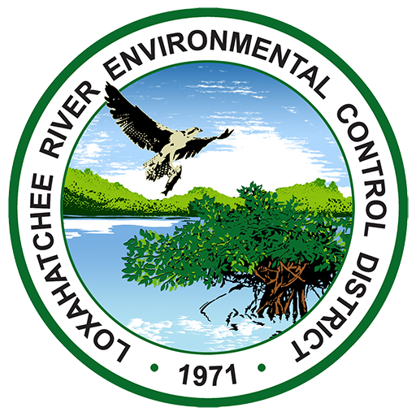

# Water Reuse Filter Upgrades
Data and code for a study of filter upgrades at a municipal water reclamation facility. This study was designed to capture operational data, pathogen removal (Cryptosporidium and Giardia), and trace organic contaminant (TOrC) removal before the replacement of the filters using the existing synthetic media filters (SMF) and traveling bridge filters (TBF) followed by evaluation of the deep bed filters (DBF) after construction and commissioning.

## Reference 
Benjamin D. Stanford, D. Albrey Arrington, William J. Raseman, and William C. Becker. (2021) "Improved Operational Reliability and Contaminant Removal in Water Reuse through Filter Upgrades". AWWA Water Science (https://awwa.onlinelibrary.wiley.com/doi/epdf/10.1002/aws2.1253). 

# Contents
- ```code/```: R code directory. As the name suggests, 00_run-all-scripts.R, will execute all scripts to reproduce the results described in the paper. If this script is not used, users should run the scripts in numerical order based on the two digits in the filename for each script. For example, scripts starting with "03" typically depend on the results of scripts starting with "02". 
- ```config/```: configuration directory. Contains a configuration file read by the R scripts to organize compounds based on biodegradation, sorption, and chloramine oxidation. 
- ```figures/```: figures directory. Contains all figures produced by the R scripts. 
- ```data/```: data directory. Contains all raw and cleaned data for the analysis. 

# Running the Code
To execute the code, first download/clone this repository and then download and install R and [R Studio](https://www.rstudio.com/products/rstudio/download/), if they are not already on your machine. Then navigate to this repository and open the ".Rproj" (R Studio project) file. This file automatically sets your working directory to the location of the .Rproj file which will enable the R scripts to run correctly (see [here](https://bookdown.org/ndphillips/YaRrr/projects-in-rstudio.html) for more details). If this file is not used, the user would have to modify each of the file/directory paths to match those on their local machine.

# Organizations
This project was carried out by the Loxahatchee River District (Jupiter, FL) and [Hazen and Sawyer](https://www.hazenandsawyer.com/)
<br><br>

<br><br>

